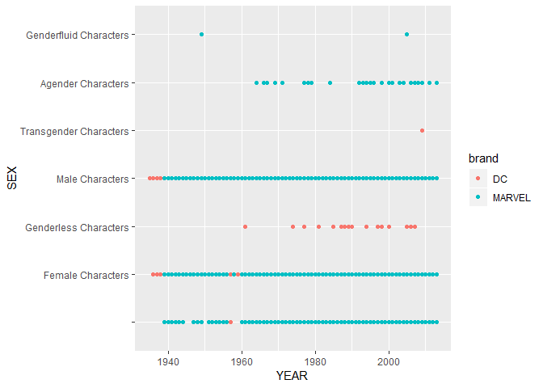
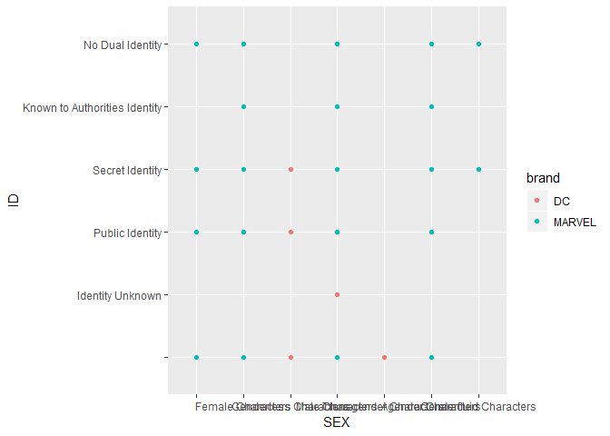

Homework 03: Create Visualization
================

``` r
library(dplyr)
```

    ## 
    ## Attaching package: 'dplyr'

    ## The following objects are masked from 'package:stats':
    ## 
    ##     filter, lag

    ## The following objects are masked from 'package:base':
    ## 
    ##     intersect, setdiff, setequal, union

``` r
library(tidyr)
library(tidyverse)
```

    ## -- Attaching packages --------------------------------------- tidyverse 1.2.1 --

    ## v ggplot2 3.0.0     v purrr   0.2.5
    ## v tibble  2.0.1     v stringr 1.3.1
    ## v readr   1.1.1     v forcats 0.3.0

    ## Warning: package 'tibble' was built under R version 3.5.2

    ## -- Conflicts ------------------------------------------ tidyverse_conflicts() --
    ## x dplyr::filter() masks stats::filter()
    ## x dplyr::lag()    masks stats::lag()

``` r
library(tibble)
library(ggplot2)
```

Load Data
---------

``` r
read.csv("data/dc-wikia-data.csv") -> dc_data
read.csv("data/marvel-wikia-data.csv") -> marvel_data
rbind(dc_data, marvel_data) -> comic_data

data.frame(dc_data) -> dc_df
data.frame(marvel_data) -> marvel_df
data.frame(comic_data) -> comic_df
```

``` r
ggplot(data=comic_df, aes(x= YEAR, y=SEX)) +
  geom_point(aes(color=brand))
```

    ## Warning: Removed 884 rows containing missing values (geom_point).



``` r
ggplot(data=comic_df, aes(x= SEX, y=ID)) +
  geom_point(aes(color=brand))
```



Comic Book characters: Private identity by sex, year of publication and publication (Marvel or DC)

Is it truthful? Is it functional? Is it beautiful? Is it insightful? Is it enlightening?
